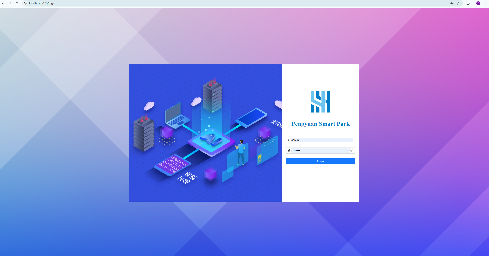
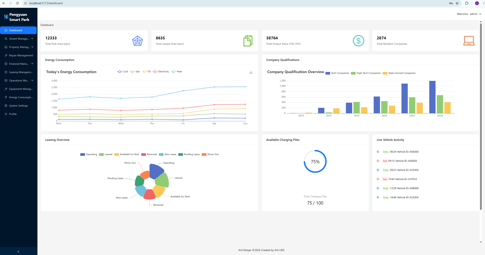
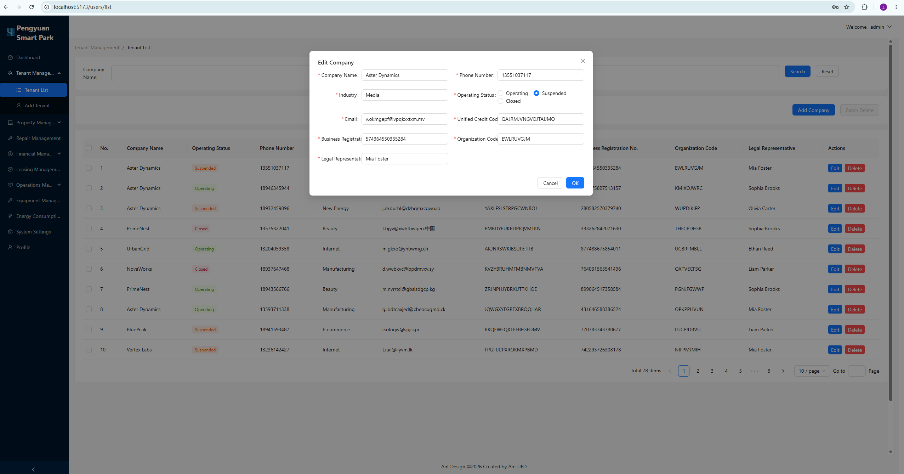

# Business Park Management System

A modern business park management dashboard built with React, TypeScript and Redux Toolkit.

## Overview

Business Park Management System is a frontend administration platform designed to simulate the daily operations of a commercial business park.

The system provides centralized management for tenants, properties, contracts, maintenance requests, financial records and operational monitoring through a role-based dashboard interface.

This project was developed as a personal frontend portfolio project to strengthen practical experience with modern React development, state management, authentication, route protection and enterprise-style dashboard architecture.

## Features

### Authentication & Authorization

- User login system
- Protected routes
- Role-Based Access Control (RBAC)
- Dynamic menu generation based on user permissions
- Authentication state management using Redux Toolkit

### Dashboard

- Business overview dashboard
- KPI statistics cards
- Operational data visualization
- Charts and analytics panels

### Business Management Modules

- Tenant Management
- Property Management
- Contract Management
- Financial Management
- Maintenance Management
- Equipment Management
- Operational Management
- User Management

### User Experience

- Search and filtering
- Pagination
- Form validation
- Responsive layouts
- Reusable UI components
- Consistent dashboard navigation

## Tech Stack

### Frontend

- React
- TypeScript
- Redux Toolkit
- React Router
- Axios
- Ant Design
- SCSS
- Vite

### Development Tools

- Git
- GitHub
- ESLint

## Screenshots

### Login Page

### Dashboard

### Tenant Management

## Project Structure

- `api`
- `assets`
- `components`
- `page`
- `router`
- `store`
- `utils`

## Current Status

Work in Progress.

## Future Improvements

- Backend integration
- Real authentication service
- Data export functionality
- Internationalization (i18n)
- Unit testing
- Performance optimization

## Author

ZiXiao Fan

MSc Software Systems, University of Bath
